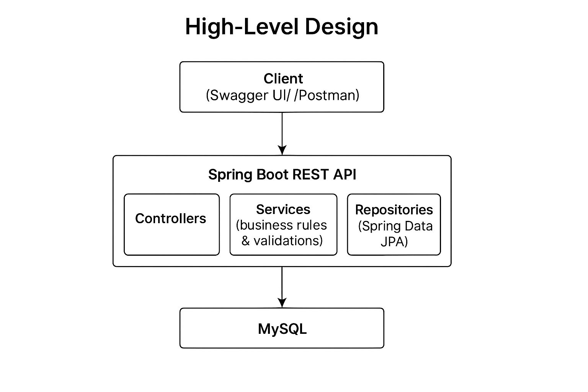

# Mini Leave Management System

## 📑 Table of Contents
1. Problem Statement

2. Project Overview

3. Data Modelling (ER Diagram + Tables)

4. Low-Level Design (Class Diagram + Pseudocode)

5. Setup Instructions

6. Assumptions

7. Edge Cases Handled

8. API Contracts

9. High-Level Design & Architecture

10. Potential Improvements

11. Submission

---


## 1. Project Statement
The goal is to build a Mini Leave Management System (LMS) for a startup with 50 employees.

The HR/Admin should be able to:

- Add employees with details (Name, Email, Department, Joining Date)

- Apply, approve, and reject leave requests

- Track leave balance for each employee
---
## 2. Project Overview

The LMS MVP covers:

- 👤 Employee management

- 📅 Leave application

- ✅ Approval/Rejection workflow

- 📊 Leave balance tracking
---
## Tech Stack
- **Backend**: Spring Boot, Java
- **Database**: MySQL
- **Documentation**: Swagger / OpenAPI
- **Build Tool**: Maven
---
## 3. Data Modelling
1. **ER Diagram**


2. Keys, Relationships, Indexes (Summary)

- EMPLOYEE

    - PK (id)

    - UK (email)

    - Index: (department)

- LEAVE_REQUEST

    - PK (id)

    - FK (employee_id) → EMPLOYEE(id)

    - Indexes: (employee_id, status), (start_date), (end_date)

- LEAVE_TRANSACTION

    - PK (id)

    - FK (leave_request_id) → LEAVE_REQUEST(id)

    - FK (employee_id) → EMPLOYEE(id)

    - Indexes: (employee_id), (leave_request_id), (created_at)

3. MySQL DDL (ready to run)
```
CREATE TABLE employee (
  id BIGINT PRIMARY KEY AUTO_INCREMENT,
  name VARCHAR(100) NOT NULL,
  email VARCHAR(120) NOT NULL UNIQUE,
  department VARCHAR(80) NOT NULL,
  joining_date DATE NOT NULL,
  leave_balance INT NOT NULL DEFAULT 20,
  created_at DATETIME NOT NULL DEFAULT CURRENT_TIMESTAMP,
  updated_at DATETIME NOT NULL DEFAULT CURRENT_TIMESTAMP ON UPDATE CURRENT_TIMESTAMP
) ENGINE=InnoDB;

CREATE TABLE leave_request (
  id BIGINT PRIMARY KEY AUTO_INCREMENT,
  employee_id BIGINT NOT NULL,
  start_date DATE NOT NULL,
  end_date DATE NOT NULL,
  status ENUM('PENDING','APPROVED','REJECTED','CANCELLED') NOT NULL DEFAULT 'PENDING',
  applied_on DATE NOT NULL,
  reason VARCHAR(255),
  created_at DATETIME NOT NULL DEFAULT CURRENT_TIMESTAMP,
  updated_at DATETIME NOT NULL DEFAULT CURRENT_TIMESTAMP ON UPDATE CURRENT_TIMESTAMP,
  CONSTRAINT fk_leave_emp FOREIGN KEY (employee_id) REFERENCES employee(id),
  INDEX idx_leave_emp_status (employee_id, status),
  INDEX idx_leave_start (start_date),
  INDEX idx_leave_end (end_date)
) ENGINE=InnoDB;

CREATE TABLE leave_transaction (
  id BIGINT PRIMARY KEY AUTO_INCREMENT,
  leave_request_id BIGINT NOT NULL,
  employee_id BIGINT NOT NULL,
  action ENUM('APPLY','APPROVE','REJECT','CANCEL') NOT NULL,
  from_status ENUM('PENDING','APPROVED','REJECTED','CANCELLED') NULL,
  to_status ENUM('PENDING','APPROVED','REJECTED','CANCELLED') NOT NULL,
  days_delta INT DEFAULT 0,
  performed_by VARCHAR(120),
  remarks VARCHAR(255),
  created_at DATETIME NOT NULL DEFAULT CURRENT_TIMESTAMP,
  CONSTRAINT fk_txn_leave FOREIGN KEY (leave_request_id) REFERENCES leave_request(id),
  CONSTRAINT fk_txn_emp FOREIGN KEY (employee_id) REFERENCES employee(id),
  INDEX idx_txn_emp (employee_id),
  INDEX idx_txn_leave (leave_request_id),
  INDEX idx_txn_created (created_at)
) ENGINE=InnoDB;
```

## 4. Low-Level Design


---

## Pseudocode -- Leave Logic
Apply Leave
```
function applyLeave(req):
  emp = employeeRepo.findById(req.employeeId) or throw 404

  if req.startDate < emp.joiningDate:
      throw 400 "Cannot apply before joining date"

  if req.endDate < req.startDate:
      throw 400 "End date before start date"

  days = (endDate - startDate) + 1

  if days > emp.leaveBalance:
      throw 400 "Insufficient balance"

  if overlapExists(emp.id, req.startDate, req.endDate):
      throw 400 "Overlapping leave"

  req.status = PENDING
  req.appliedOn = today()
  saved = leaveRepo.save(req)

  txnRepo.save( Txn(APPLY, null -> PENDING, days_delta=0, employeeId=emp.id, leaveId=saved.id) )

  return saved
```
Approve Leave
```
function approveLeave(leaveId):
  lr = leaveRepo.findById(leaveId) or throw 404
  emp = employeeRepo.findById(lr.employeeId) or throw 404

  days = (lr.endDate - lr.startDate) + 1

  if days > emp.leaveBalance:
      throw 409 "Insufficient balance at approval time"

  emp.leaveBalance -= days
  employeeRepo.save(emp)

  prev = lr.status
  lr.status = APPROVED
  saved = leaveRepo.save(lr)

  txnRepo.save( Txn(APPROVE, prev -> APPROVED, days_delta = -days, employeeId=emp.id, leaveId=lr.id) )

  return saved
```
Reject Leave
```
function rejectLeave(leaveId):
  lr = leaveRepo.findById(leaveId) or throw 404
  prev = lr.status
  lr.status = REJECTED
  saved = leaveRepo.save(lr)

  txnRepo.save( Txn(REJECT, prev -> REJECTED, days_delta = 0, employeeId=lr.employeeId, leaveId=lr.id) )

  return saved
```
Overlap Check
```
function overlapExists(empId, start, end):
  approved = leaveRepo.findByEmployeeIdAndStatus(empId, APPROVED)
  for each a in approved:
     if not (end < a.startDate or start > a.endDate):
         return true
  return false
```
---

## 5. Setup Instructions
1. Clone the repository:
```bash
git clone <repository-url>
cd mini-leave-management
```

2. Configure MySQL in application.properties:
```
spring.datasource.url=jdbc:mysql://localhost:3306/lms_db
spring.datasource.username=root
spring.datasource.password=<your-password>
spring.jpa.hibernate.ddl-auto=update

```
3. Setup Database Schema & Sample Data: 
```
# Create the database
mysql -u root -p -e "CREATE DATABASE lms_db;"

# Import schema
mysql -u root -p lms_db < data/schema.sql

# Import sample data
mysql -u root -p lms_db < data/data.sql
```

### Quick Start with Script

Alternatively, you can run the provided shell script to setup the database and start the app:

```bash
chmod +x run_sample.sh
./run_sample.sh
```
3. Run the Application:
```
mvn clean install
mvn spring-boot:run

```

4. Access the Appliaction:
```
Swagger UI: http://localhost:8080/swagger-ui.html

API Base URL: http://localhost:8080/
```
---
## 6. Assumptions
- Default leave balance = 20 days

- Leave types not considered (MVP)

- Only HR/Admin approves/rejects

- Date format = yyyy-MM-dd
---
## 7. Edges Cases Handled
- Applying leave before joining date

- Applying for more days than available balance

- Overlapping leave requests

- Invalid date ranges (end < start)

- Non-existent employee or leave ID

- Re-approving/rejecting already processed leave
---
## 8. API Contracts
Employee APIs

➤ Add Employee
```
POST /employee/add
```
Request:
```
{
  "name": "John Doe",
  "email": "john@example.com",
  "department": "IT",
  "joiningDate": "2025-08-01",
  "leaveBalance": 20
}
```
- 201 Created — Response
```
{
  "id": 1,
  "name": "John Doe",
  "email": "john@example.com",
  "department": "IT",
  "joiningDate": "2025-08-01",
  "leaveBalance": 20
}

```
- 409 if email exists.
Leave APIs

➤ Apply Leave
```
POST /leave/apply
```
Request:
```
{
  "employeeId": 1,
  "startDate": "2025-08-20",
  "endDate": "2025-08-22",
  "reason": "Family function"
}

```
- 201 Created — Response
```
{
  "id": 10,
  "employeeId": 1,
  "startDate": "2025-08-20",
  "endDate": "2025-08-22",
  "status": "PENDING",
  "appliedOn": "2025-08-18",
  "reason": "Family function"
}

```
- 400/404 with message for invalid dates / employee not found / overlaps / > balance.
➤ Approve Leave
```
POST /leave/approve?leaveId=10
```
- 200 OK — Response
```
{
  "id": 10,
  "employeeId": 1,
  "startDate": "2025-08-20",
  "endDate": "2025-08-22",
  "status": "APPROVED"
}
```
- 409 if insufficient balance at approval time.
- 404 if leave not found.
➤ Reject Leave
```
POST /leave/reject?leaveId=10
```
- 200 OK — Response
```
{
  "id": 10,
  "employeeId": 1,
  "status": "REJECTED"
}

```
➤ Get Leave Balance
```
GET /employee/{id}/balance
```
- 200 OK — Response
```
{ "employeeId": 1, "leaveBalance": 17 }

```
➤List Leaves (optional filter)
```
GET /leave/all?employeeId=1
```
- 200 OK — Response
```
[
  { "id": 10, "employeeId": 1, "startDate": "2025-08-20", "endDate": "2025-08-22", "status": "APPROVED" }
]
```

## 9. High-Level Design & Architecture
Architecture: 
```
Client (Swagger UI/Postman)

        |
        v
    
Spring Boot REST API
  - Controllers
  - Services (business rules & validations)
  - Repositories (Spring Data JPA)

        |
        v

      MySQL

```



---
## 10. Potential Improvements

- Add leave types (Sick, Casual, Paid)

- Role-based access control (HR, Manager, Employee)

- Email notifications for approval/rejection

- UI with React/Angular

- Deploy on Heroku / Render / Vercel
---

## Submission

Contents of ZIP:

1. /src - All Java source code
2. pom.xml - Maven build file
3. README.md - Complete project documentation with:
   - Problem Statement
   - Project Overview
   - Data Modelling (ER Diagram + Tables)
   - Low-Level Design (Class Diagram + Pseudocode)
   - Setup Instructions
   - Assumptions
   - Edge Cases Handled
   - API Contracts
   - High-Level Design & Architecture
   - Potential Improvements
4. /docs - Postman collection
5. ERD.md - Mermaid ER Diagram
6. LLD.md - Class diagram + Pseudocode
7. /images - PNG exports of diagrams (optional)
8. data.sql - Sample data for testing
9. run_sample.sh - Script to setup DB and run app

(Optional)
- Postman collection JSON or cURL commands
- Deployment notes + live URL if deployed

---
